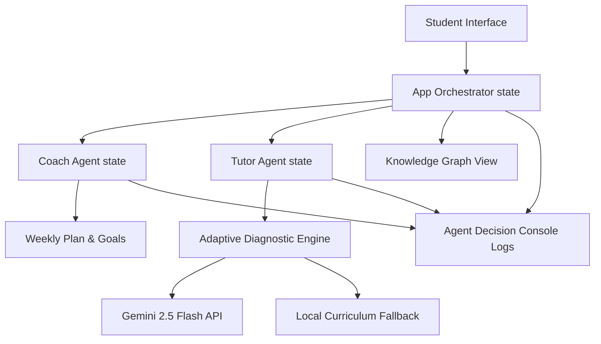

# AceSAT: Adaptive SAT Prep & Study Coach AI-Agent

> **Submission for the AceSAT Education AI-Agent Hackathon**  
> *Closing the education gap for students in underserved public schools.*

AceSAT is a next-generation AI-powered learning companion that functions as a tireless, personalized tutor. Unlike basic chatbots that simply answer questions, AceSAT operates as a true educational agent: it actively diagnoses a student's strengths and weaknesses, crafts customized weekly study plans, dynamically adjusts question difficulty, and guides the student using educational scaffolding (hints and concepts) rather than giving away the answers.

---

## 🚀 Core Features

### 1. **Dynamic Onboarding & Weekly Study Coach**
*   **Coach Chat**: Interactive onboarding conversational flow with **Coach Ace**. It asks students about their target scores, dedication hours, and focus areas.
*   **Study Plan Planner**: Instantiates a custom weekly study plan in the dashboard based on student responses.

### 2. **Adaptive SAT Prep Workspace**
*   **Diagnostic Question Generator**: Dynamically shifts between **Easy**, **Medium**, and **Hard** problems per topic depending on correct/incorrect responses.
*   **Three-Level Scaffolding Engine**: Students can request hints that scale from *Level 1: Conceptual Reminder* to *Level 2: Step Guide*, and finally *Level 3: Near-Solution Calculation Hint*.
*   **Live Gemini Integration**: Features an optional direct Gemini API Key input field for live, open-ended SAT question generation and coaching feedback, alongside a rich, pre-built curriculum simulation.

### 3. **Interactive Knowledge Graph**
*   **Visual Mastery Map**: Renders coordinates-based SVG connections illustrating SAT topic prerequisites.
*   **Topic Color-Coding**: Instantly highlights topic mastery levels: **Green (Mastered >75%)**, **Yellow (Developing)**, and **Red (Focus Area <50%)**.
*   **Direct Context Launcher**: Click any node to review curriculum details and launch specialized practice sessions.

### 4. **Agent Decision Console**
*   **Live Telemetry Logs**: A terminal console that displays the agent's internal thinking log in real time (e.g. routing adjustments, score changes, scaffolding levels).
*   **Transparent Logic**: Shows how correct/incorrect answers impact mastery and trigger diagnostic shifts.

---

## 🛠️ System Architecture



---

## 📦 Installation & Setup

Ensure you have **Node.js** (v18 or higher) installed on your system.

1. **Clone or Extract the Directory**:
   ```bash
   cd C:\Users\admin\.gemini\antigravity\scratch\acesat-agent
   ```

2. **Install Dependencies**:
   ```bash
   npm install
   ```

3. **Launch the Development Server**:
   ```bash
   npm run dev
   ```

4. **Build for Production**:
   ```bash
   npm run build
   ```

---

## 📝 Problem Statement & Impact Write-Up

### The Problem: The Tutoring Gap
Wealthy families spend thousands of dollars on private SAT tutors, college prep coaching, and structured homework networks. For students in underserved public schools, these resources are entirely out of reach. These students often go home to households without academic support networks, resulting in a persistent performance gap.

### The Solution: An AI Tutoring Agent
AceSAT models the behavior of a human private tutor. By structuring the AI as a proactive agent that makes pedagogical choices (adjusting difficulty, choosing scaffolded hints, and tracking concept mastery), we create an equitable tutoring companion. It is highly accessible, responsive, and available 24/7.

### Potential Impact
Deploying AceSAT in public schools can level the playing field by:
1.  **Lowering the Barrier to Entry**: Providing professional-grade SAT prep entirely for free, compatible with low-end devices and slow internet connections.
2.  **Encouraging Mastery Learning**: Scaffolding problems so students learn *how* to solve them rather than getting demotivated by incorrect answers or relying on copy-pasting.
3.  **Visualizing Competency**: Making diagnostic details visible via the Knowledge Graph, empowering students to take charge of their own learning paths.
